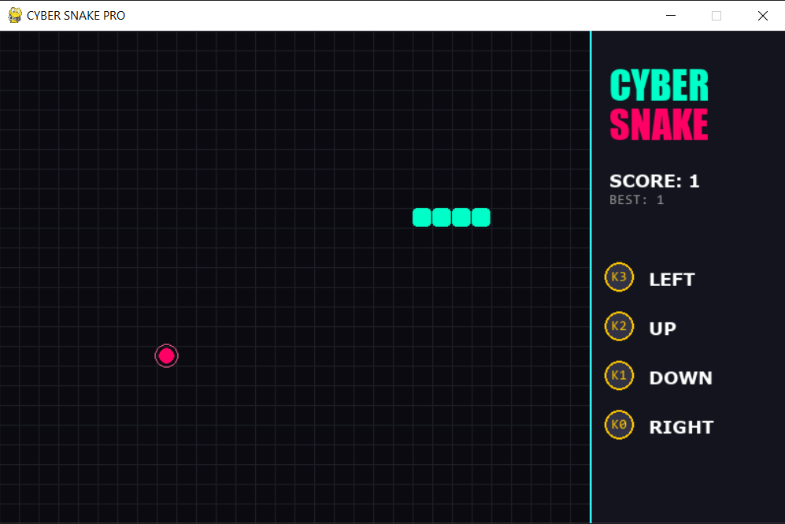
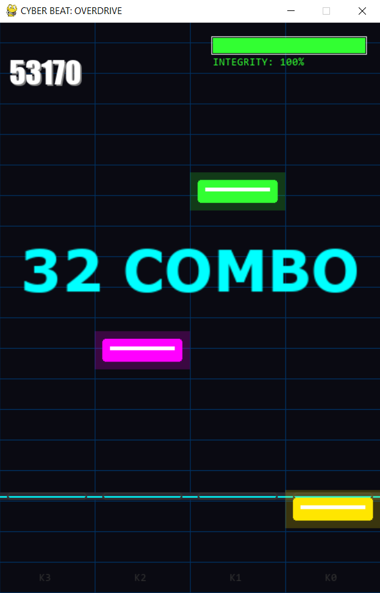
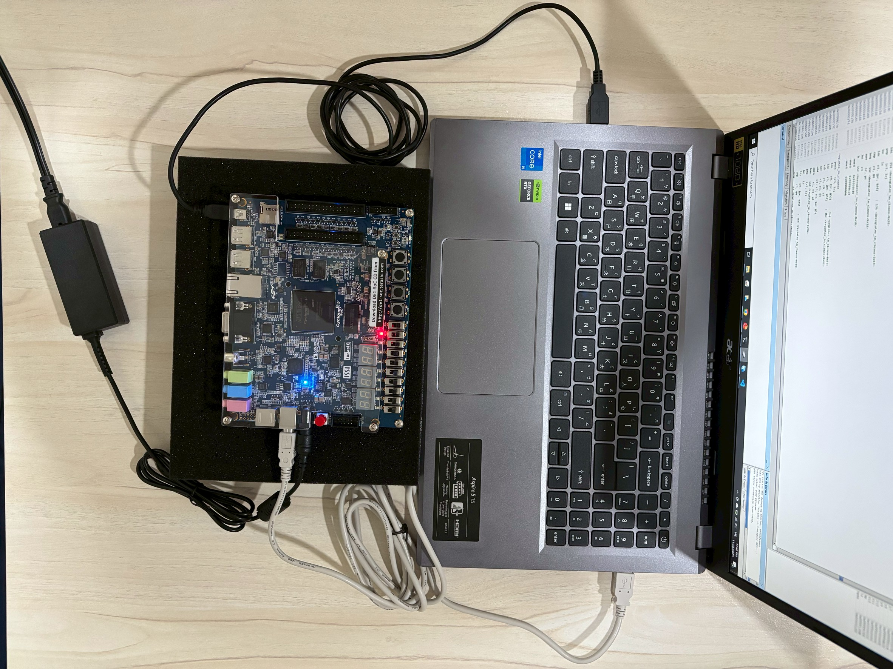

# 🎮 MOS Cyber Console (Renode x DE1-SoC)

---

## 🌟 Acknowledgement & Credits
<p align="justify">
This project is an extended implementation based on the <b>MOS-Renode</b> framework. We strictly attribute the core operating system and simulation environment to the original author.
</p>

> **Original Source Code:** [https://github.com/Eplankton/mos-renode](https://github.com/Eplankton/mos-renode)  
> **Author:** Eplankton

---

## 📖 Introduction
<p align="justify">
<b>MOS Cyber Console</b> is a hybrid embedded system that bridges the gap between <b>Hardware Emulation</b> and <b>Physical Interaction</b>. It uniquely integrates a Real-Time Operating System (<b>MOS RTOS</b>), Hardware Emulation (<b>Renode</b>), and Physical Hardware (<b>DE1-SoC FPGA Board</b>).
<br><br>
The system features a centralized <b>Python Controller</b> that bridges communication between the simulated STM32F4 environment and the physical world. This architecture allows users to play interactive games using either a standard PC keyboard or the physical keys on the DE1-SoC board, providing a seamless "Cyber-Physical" experience.
</p>

---

## 📺 Video Demo
<div align="center">

[](https://www.youtube.com/watch?v=YOUR_VIDEO_ID_HERE)

*(Click the image above to watch the gameplay demo)*
</div>

---

## 📸 Project Gallery

<div align="justify">

### 🐍 1. Cyber Snake Game
A neon-styled classic snake game running with bi-directional feedback.

### 🎹 2. Cyber Beat Revolution
A rhythm game requiring precise timing, featuring visual effects and combo systems.

<table>
  <tr>
    <td align="center">
      
      <br><b>Cyber Snake Game</b>
    </td>
    <td align="center">
      
      <br><b>Cyber Beat Revolution</b>
    </td>
  </tr>
</table>

### 🔌 3. Hardware Setup (DE1-SoC)
*The physical interface using Altera DE1-SoC board, connected via UART to control the games.* <br><br>

<td align="center"

</td>

</div>

---

## 🚀 Features
<p align="justify">
<ul>
  <li><b>Hybrid Architecture:</b> Seamless communication between simulated STM32F4 (Renode) and real-world FPGA hardware via UART.</li>
  <li><b>MOS RTOS Integration:</b> Utilizes MOS Shell tasks for efficient command dispatching and multitasking.</li>
  <li><b>Dual Control Modes:</b>
    <ul>
      <li><b>Simulation Mode:</b> Control games via PC Keyboard (WASD / Arrow Keys).</li>
      <li><b>Hardware Mode:</b> Control games via DE1-SoC Push Buttons (KEY0 - KEY3).</li>
    </ul>
  </li>
  <li><b>Game Library:</b> Includes <i>Cyber Snake</i> and <i>Cyber Beat</i>, upgraded with high-quality visual effects (particles, screen shake, neon glow).</li>
</ul>
</p>

---
    
## 📂 Project Structure

```text
Renode-UART-Controller/
├── app/ & core/          # Source code for MOS RTOS (C++)
├── emulation/            # Renode scripts (.resc) for STM32F4 simulation
├── de1_soc_firmware/     # C firmware and Makefile for DE1-SoC board
├── pic/                  # Images and Demo screenshots
├── controller.py         # Master Python Controller (UART Bridge & Game Launcher)
├── cyber_snake_game.py   # Snake Game Module
├── cyber_beat_game.py    # Rhythm Game Module
└── mos-renode.code-workspace # VS Code Workspace configuration
```

---

## 🛠️ Prerequisites
1.  **Renode:** Required for emulating the STM32F4 chip.
2.  **Python 3.x:** With `pygame` and `pyserial` libraries installed.
    ```bash
    
    pip install pygame pyserial
    ```
3.  **DE1-SoC Board:** (Optional) Connected via USB-Serial (e.g., COM5).
4.  **ARM GCC Toolchain:** To build the MOS firmware.

---

## ⚡ How to Run

### Step 1: Start OS Emulation (Renode)
Open a terminal in the project root and execute the script:
```bash
renode emulation\debug_config.resc
```
💡 Note: In the Renode Monitor window that appears, type start and press <kbd>Enter</kbd> to boot the MOS Operating System.


### Step 2: Launch the Master Controller
Open a separate terminal window and run:
```bash
python controller.py
```
The controller will automatically attempt to establish a bridge between:
<ul>
  <li>📡 Renode UART (localhost:3333) </li>
  <li>🔌 DE1-SoC Hardware (Active COM Port)</li>
</ul>

### Step 3: Game Selection
Once connected, the main menu will appear. You can control the system using either your PC Keyboard or the DE1-SoC 
<ul>
    <li>*Press Key 0 (or 'S') to launch Cyber Snake.*</li>
    <li>*Press Key 1 (or 'B') to launch Cyber Beat.*</li>
</ul>

## 📜 License
This project is based on MOS-Renode and modified for educational purposes.
